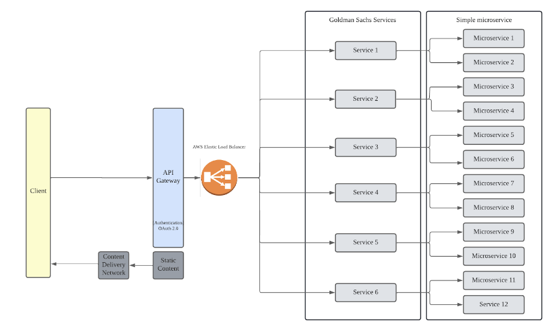

# BrainNotFound 404

<!-- TABLE OF CONTENTS -->
<details>
  <summary>Table of Contents</summary>
  <ol>
    <li><a href="#pitchdeck">Pitch Deck</a></li>
    <li><a href="#pitchvideo">Pitch Video</a></li>
    <li><a href="#figmamockup">Figma Mockup</a></li>
    <li>
      <a href="#solution-outline">Solution Outline</a>
      <ol>
        <li><a href="#deep-dive">Deep Dive</a></li>
        <li><a href="#built-with">Built With</a></li>
        <li><a href="#solution-architecture">Solution Architecture</a></li>
      </ol>
    </li>
    <li><a href="#setup">Project Setup</a></li>
    <li><a href="#prerequisites">Prerequisites</a></li>
    <li><a href="#installation">Installation</a></li>
  </ol>
</details>

## [PitchDeck]
## [PitchVideo]
## [FigmaMockup]


## Solution Outline

With the rise in usage of eCommerce platforms, our group aims to tab on the existing microservices architecture (MSA) that supports Goldman Sachs’ existing services into frequently used eCommerce platforms such as Shopee. We have chosen to target the eCommerce industry because it provides multi-channel services, and these services are highly-correlated with Goldman Sachs services. Upon the successful deployment of MSA, the developer team from Goldman Sachs can also provide the technical expertise and host the services which Goldman Sachs uses on our client’s servers, reducing the need for an authentication and authorisation through the API Gateway. 

Through the usage of these microservices, this would target the following problems faced by common eCommerce platforms: 
* To establish and improve the connectivity between Goldman Sachs and the eCommerce platform.
* To reduce the cost of using our services by the eCommerce platforms.
* To improve the response time lag when using our services through an API gateway deployment, making it a smoother and more efficient process for our eCommerce clients.

<p align="right">(<a href="#readme-top">back to top</a>)</p>


## Deep Dive
Our team aims to tab on the existing services and architecture which Goldman Sachs have in place. With the implementation of an API gateway, developer teams from client companies will have to obtain Authorisation Rights to use a specific API from our company. Upon the successful authentication of the Authorisation Rights, the API gateway will route them accordingly to the specific Goldman Sachs services they want to use, for instance conducting thorough market analysis or risk management reports for them.

For companies which wish to have a full package without needing to go through the hassle of an authentication and authorisation with Goldman Sachs, we can easily assemble a working solution based on the microservices which the clients have to create a duplicate microservices architecture and allow it to run on the client’s servers as well. Hence, our solution can be deployed either by connecting to Goldman Sachs existing servers, or deployed on external client servers. 

<p align="right">(<a href="#readme-top">back to top</a>)</p>

## Built With
Our libraries include:

* [Vue]
* [Bootstrap]
* [Chartjs]
* [Axios]
* [Corejs]

<p align="right">(<a href="#readme-top">back to top</a>)</p>

## Solution Architecture


We intend on making use of AWS’s Elastic Load Balancing & AWS Lambda. AWS Elastic Load Balancing (ELB) automatically distributes incoming application traffic across multiple targets and virtual appliances in one or more Availability Zones (AZs). Using this, we will be able to control the amount of traffic for each service, reducing long loading / processing time. 

Additionally, we intend on hosting each microservice as a AWS Lambda function, where it will only be called/used when the client requests it. This will greatly reduce the costs incurred in hosting the services. 

<p align="right">(<a href="#readme-top">back to top</a>)</p>

## Setup
```
npm install
```

### Compiles and hot-reloads for development
```
npm run serve
```

### Compiles and minifies for production
```
npm run build
```

### Lints and fixes files
```
npm run lint
```

### Customize configuration
See [Configuration Reference](https://cli.vuejs.org/config/).


<!-- MARKDOWN LINKS & IMAGES -->
<!-- https://www.markdownguide.org/basic-syntax/#reference-style-links -->
[Vue]: https://vuejs.org/
[Chartjs]: https://www.chartjs.org/
[Bootstrap]: https://bootstrap-vue.org/
[Axios]: https://axios-http.com/
[Corejs]: https://www.npmjs.com/package/core-js
[PitchDeck]: https://drive.google.com/drive/folders/1PT5Ucr77N-C50jmzSrPWEiL_EpDakjhH?usp=sharing
[PitchVideo]: https://drive.google.com/drive/folders/1BIIq9qy_ugFGm6YpjOoGz9LIsmIX7iAo?usp=sharing
[FigmaMockup]: https://www.figma.com/file/5mNNLvxejr1rMY9Qx4az7y/Crypto-Dashboard-with-Component-(Light-%26-Dark-Version)-(Community)?node-id=47%3A1456